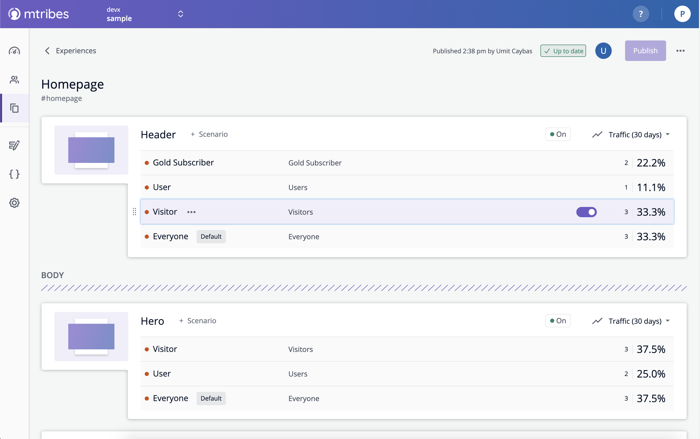
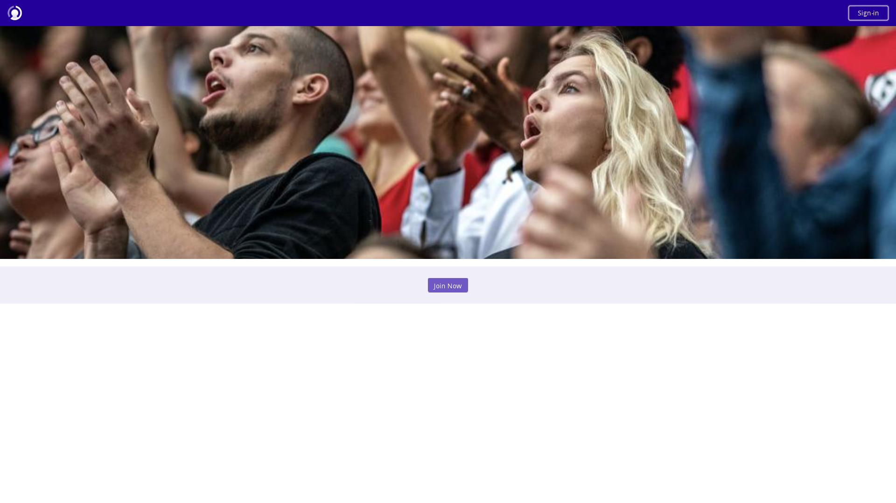

# mtribes sample - Roku

The sample project below shows how `mtribes` can be integrated with various Roku applications. 
This sample demonstrates how to add targeting control into an existing app.

## Running

### Prepare environment

To run the app on a Roku device, please install Ukor and Wist with CMD (if you
don't have npm command - please install [Node.js](https://nodejs.org/uk/)
first)

```
npm install -g @willowtreeapps/ukor @willowtreeapps/wist
```

### Configure device

Inform Ukor what device to use for running the app, by adding your device to
the list of available devices in the file **ukor.properties.yaml**.

Example:

```
rokus: {
  your_device: {
    serial: 'YH00C4474609',
    auth: {
      user: 'rokudev',
      pass: '1234'
    }
  }
}
```

### Run

To run, use the CMD Ukor install command (where the last parameter is your device from
**ukor.properties.yaml** or "ukor.local"):

```
  ukor install main your_device
```

As an alternative, you can use this command to run the app:
```
  ukor install main <your_roku_device_ip_adress> --auth=rokudev:1234
```

## Structure

The app code lies in "src/main/components". It contains 4 important files:

- `AppScene_before.brs` - sample app code before mtribes integration
- `AppScene_after.brs` - sample app code after mtribes integration
- `AppSceneUIConfig.brs` - general UI configuration
- `AppScene.xml` - main entry point to app, which can be updated to point at `AppScene_before.brs` or `AppSceneUIConfig.brs` 

The app consists of the following UI elements:

1. `Header` - displays a sign-in/out button along with welcome message when signed in
2. `Hero` - displays a different image depending on whether signed in or out
3. `Banner` - displays a `Visitor` label when signed out, and a `Member` label when signed in

`Hero` and `Banner` are moved into an mtribes `Section` to highlight the dynamic capabilities these can provide.

### mtribes Space with sample app




